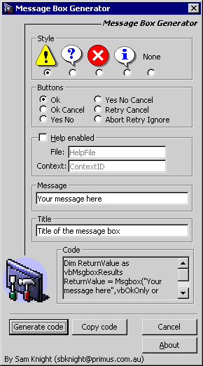



## Generate code for message boxes

### Description

Generates the code for Visual Basic to display a message box. Useful for beginners. See the Screen Shot for more information
 
### More Info
 

             |
---                |---
**Submitted On**   |2000-06-03 13:21:44
**By**             |[N/A](https://github.com/Planet-Source-Code/PSCIndex/blob/master/ByAuthor/empty.md)
**Level**          |Beginner
**User Rating**    |3.7 (11 globes from 3 users)
**Compatibility**  |VB 5\.0, VB 6\.0
**Category**       |[Miscellaneous](https://github.com/Planet-Source-Code/PSCIndex/blob/master/ByCategory/miscellaneous__1-1.md)
**World**          |[Visual Basic](https://github.com/Planet-Source-Code/PSCIndex/blob/master/ByWorld/visual-basic.md)
**Archive File**   |[CODE\_UPLOAD6384632000\.zip](https://github.com/Planet-Source-Code/generate-code-for-message-boxes__1-8552/archive/master.zip)

